# 🚗 CarTrack Admin Dashboard

A modern and responsive admin dashboard for managing automotive services, built with React and Tailwind CSS.

## ✨ Features

- 👥 Client Management
- 🔧 Service Requests Handling
- 📅 Appointment Scheduling
- 🏢 Workshop Management
- 📊 Service History Tracking
- 💼 Administrative Controls

## 🛠️ Tech Stack

- **Frontend Framework:** React
- **Styling:** Tailwind CSS
- **Routing:** React Router DOM
- **UI Components:** Radix UI
- **Icons:** Lucide React
- **Build Tool:** Vite

## 🚀 Getting Started

1. **Clone the repository**
    ```bash
    https://github.com/guelo0987/CartTrackAdmin.git
    ``` 

2. **Install dependencies**

```bash
npm install
```

3. **Start development server**

```bash
npm run dev
```

## 🏗️ Project Structure

```
cartrackadmin/
├── src/
│   ├── Components/     # Reusable UI components
│   ├── Pages/         # Page components
│   ├── App.jsx        # Main application component
│   └── main.jsx       # Application entry point
├── public/            # Static assets
└── index.html         # HTML entry point
```

## 📱 Responsive Design

The dashboard is fully responsive with breakpoints for:
- Desktop
- Laptop
- Tablet
- Mobile

## 📸 Screenshots

<details>
<summary>View Screenshots</summary>


### Client Management
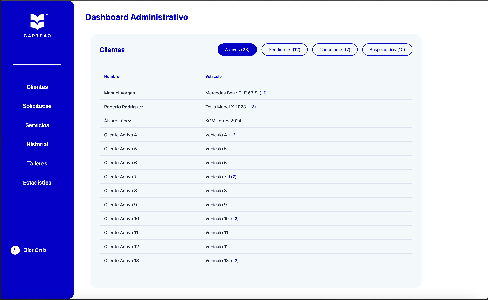
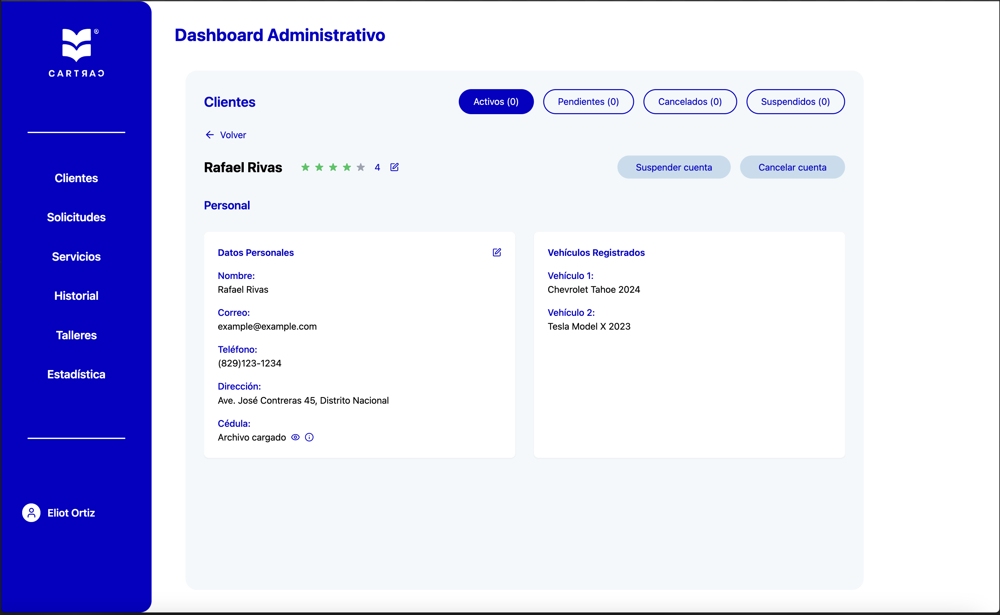
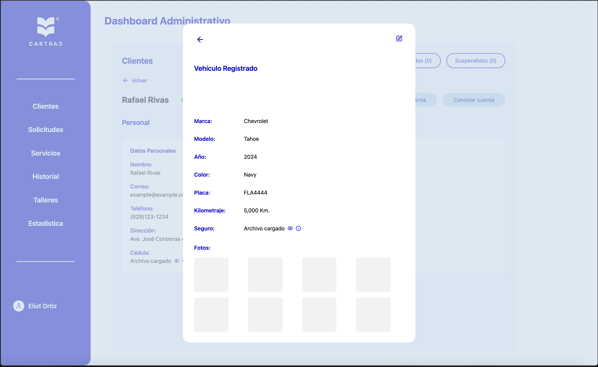
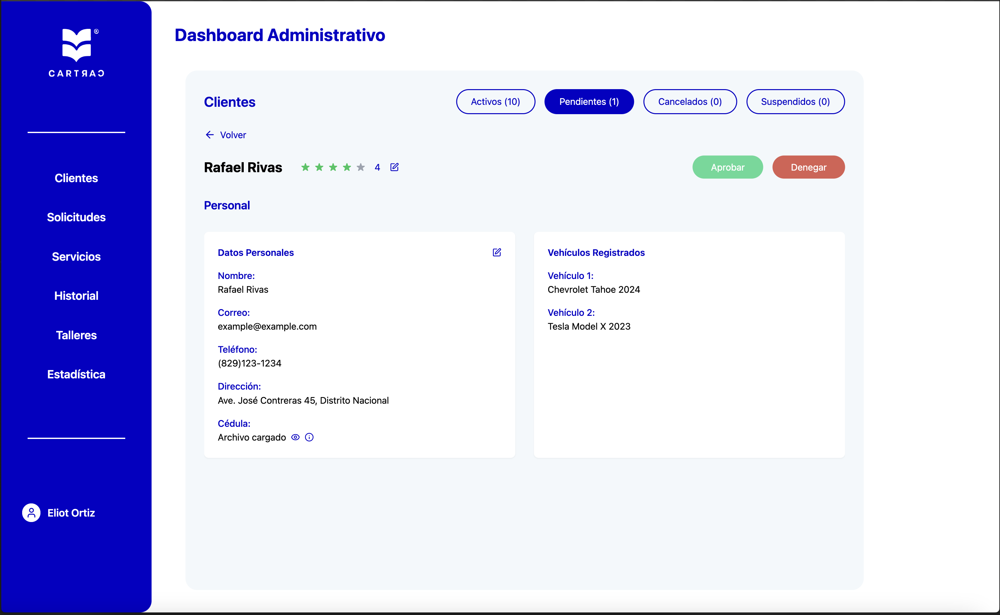
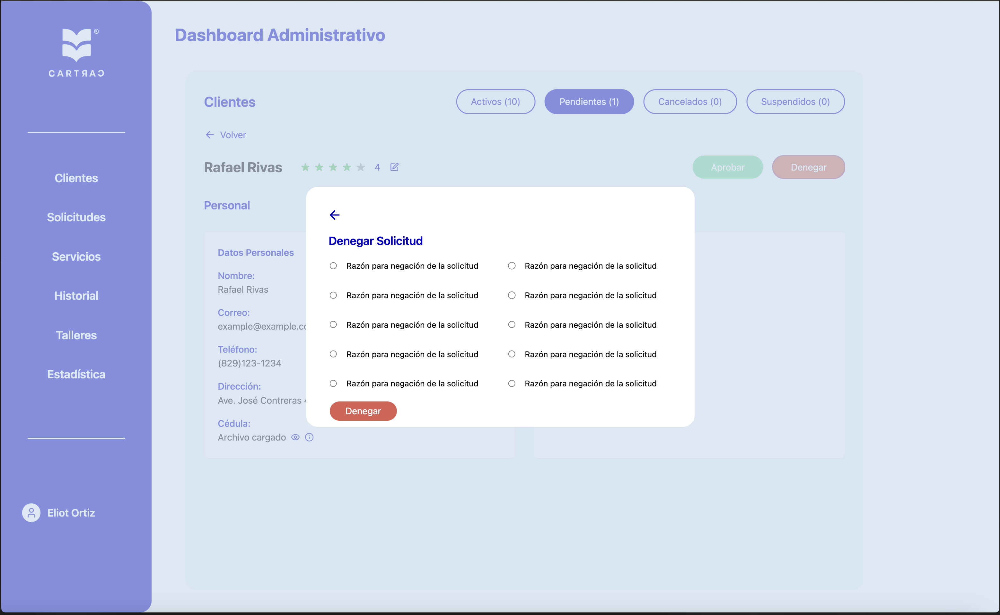


### Service Requests
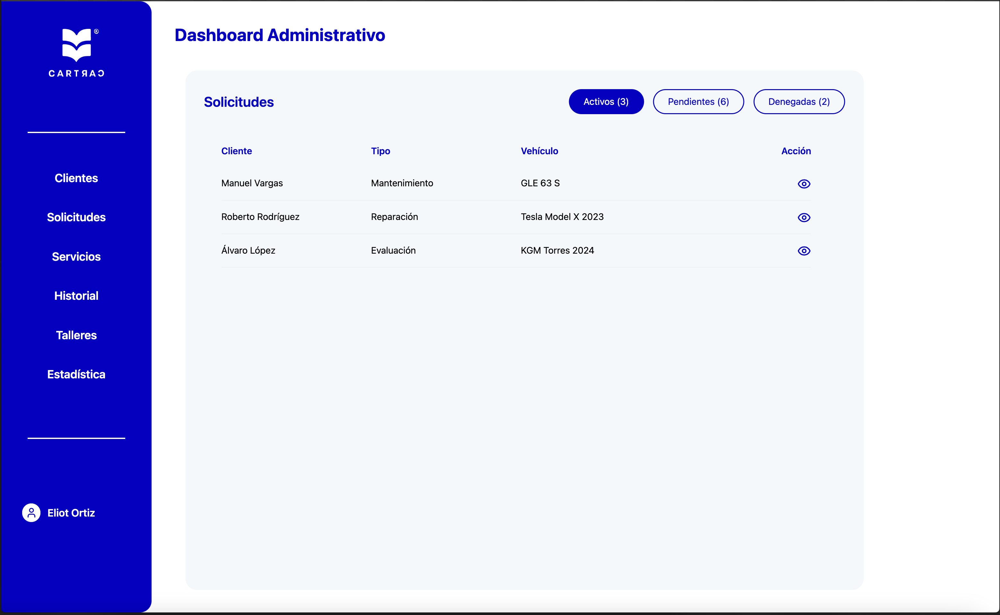
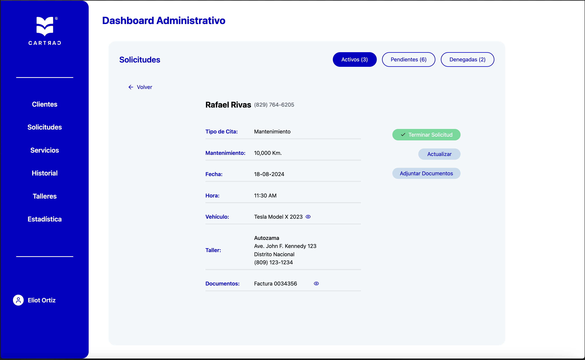
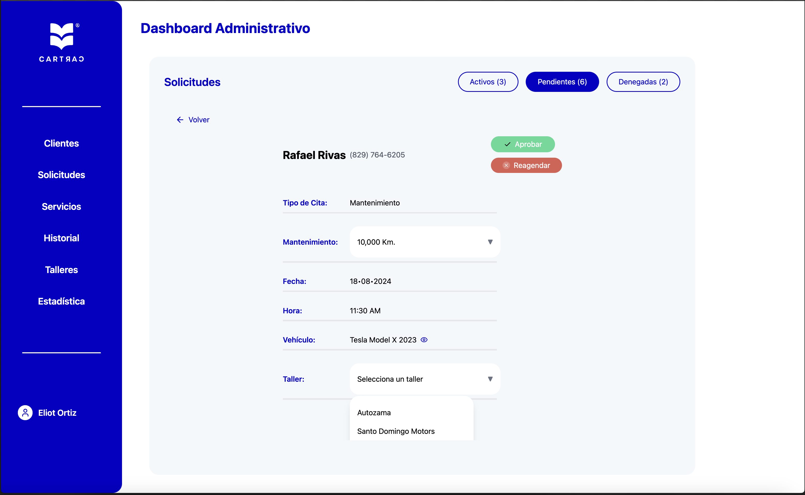

### Appointment Calendar
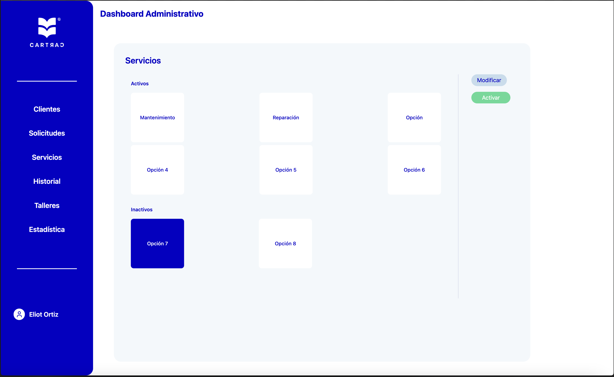
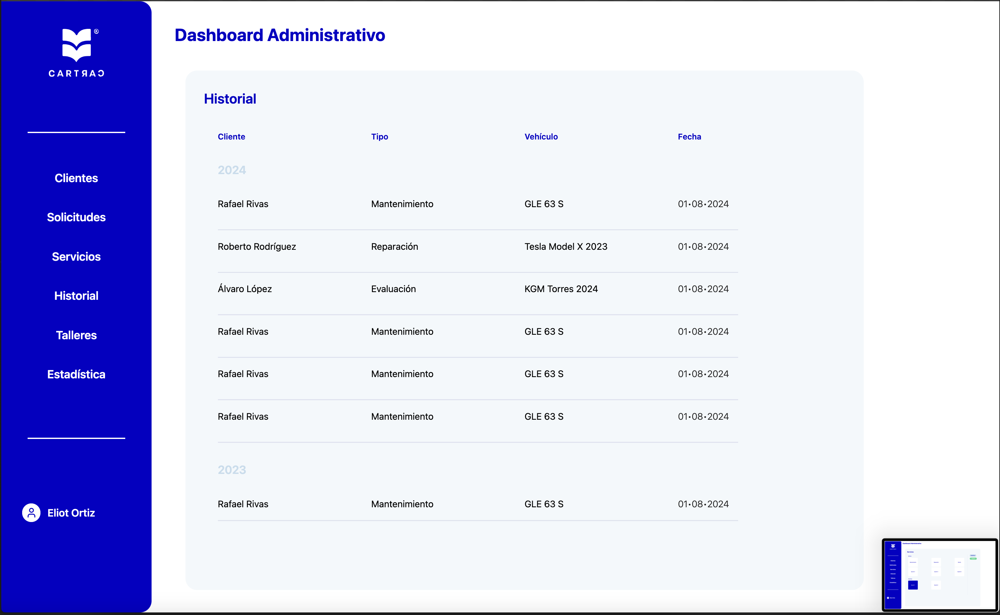
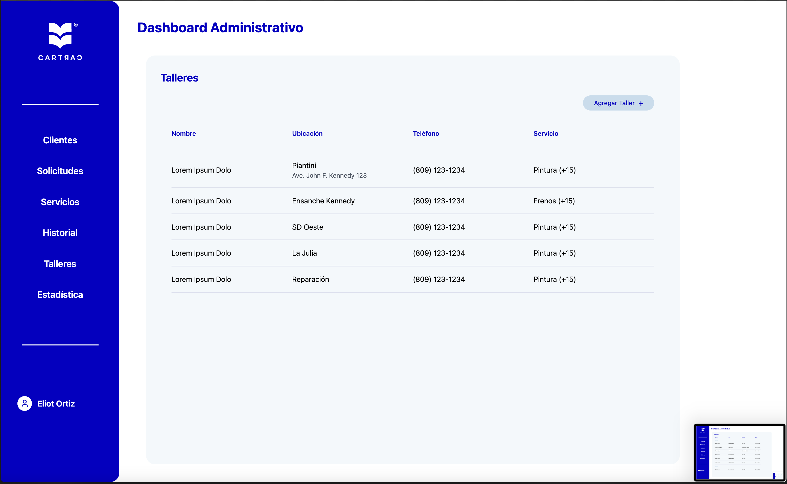

</details>

## 🎨 Color Scheme

- Primary: `#0500C6` (Deep Blue)
- Secondary: `#C6DDED` (Light Blue)
- Success: `#52DA96` (Green)
- Danger: `#DA5F52` (Red)
- Background: `#F9FBFC` (Light Gray)

## 📄 License

MIT License

## 🤝 Contributing

Contributions, issues, and feature requests are welcome!

---
Built with ❤️ for CarTrack
